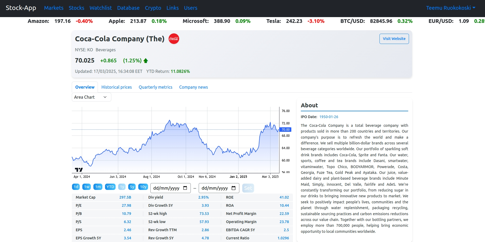

# Requirements Specification

## Purpose of the Application

The application is a web application designed for monitoring stock markets. It fetches real-time stock data from a stock API, allowing users to track historical data for both indices and individual stocks. Detailed information and fundamental metrics for individual stocks can also be displayed. Users can download historical price information and metrics for individual stocks. Users can also create their own watchlists within the application, which are saved in a database.

## Users

The application requires user login to access personalized features such as portfolio management and watchlists. This ensures that each user's data and settings are securely stored and accessible only to them. Additionally, admin users have the ability to disable or delete registered accounts as needed.

### Features (updated Feb 28 2025)

- **User registration:** Users can register an account to access personalized features.
- **User login:** Users must log in to access stock market data, their portfolios, watchlists, and other personalized functionalities.
- **Real-time indices data:** The app provides live updates for major stock indices such as the S&P500, Nasdaq, DAX, FTSE 100, and more, allowing users to stay informed of market movements.
- **Real-time stock data:** The application fetches and displays up-to-date stock price information from several stock APIs.
- **Historical data:** Users can track historical data for both indices and individual stocks.
- **Detailed stock information:** Displays in-depth details, fundamental metrics and company news for individual stocks.
- **Historical stock information:** Both historical price and metrics information can be displayed and downloaded.
- **Watchlists:** Ability to create watchlists to keep track of stocks of interest.
- **Stock screening:** Users can filter and analyze stocks based on selected metrics.
- **Real-time crypto data:** A dedicated crypto page displays live prices and other metrics for major cryptocurrencies such as Bitcoin and Ethereum.
- **Financial news:** The app displays relevant financial news, providing context for stock market movements and helping users make informed decisions.
- **Data visualization:** Includes interactive charts and graphs to help users visualize stock performance and trends over time.

### User Interface

